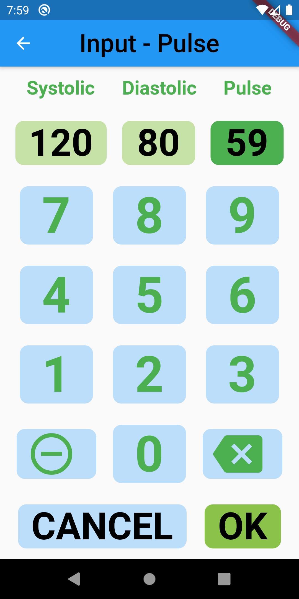

# bp_app

Android app wirtten using Flutter.

It is a simple Blood Pressure Logging Application.

Developed using Android Studio.

This is my first Flutter app. I have written some Dart in the past but that was some time ago replacing some Java Script in the browser.

Comments and feedback are always welcome.

The app records Date Time, Systolic, Diastolic and Pulse.

It stores the data in a JSON file:

``` JSON
{
  "name": "Fred",
  "data": [
    {
      "i": 1597654200000,
      "n": 0,
      "s": 147,
      "d": 89,
      "p": 63
    },
    {
      "i": 1597613400000,
      "h": 1,
      "s": 178,
      "d": 88,
      "p": 67
    }
  ]
}
```

The id is a timestamp (number of millis since the epoch)

The hide field enables entries to be hidden. There is currently no delete function.

Things still to do:

## Graph of the data

Draw a graph of the data points based on time so you can see trends in you data.

## Better backup

Currently you can take a snapshot and store it in a Backup file.

You can export the Backup file OR the Primary file to the clipboard as JSON.

You can paste raw JSON in to a text field and import that as data.

This currently allows me to export my data, paset it into and email and send it to myself as a perminent backup.

I can then update the data, delete, ammend etc using an editor on my PC, email it back to my phone and import it as above.

It is all a bit crude at the moment. A better export/import solution is  needed.

## Publish

This is not a main issue for me. I wrote it for me and I can load it on my phone. Job done.

At some point this will be covered, I need to know how it is done so this will be a good way to learn.

## Screen Shots below





